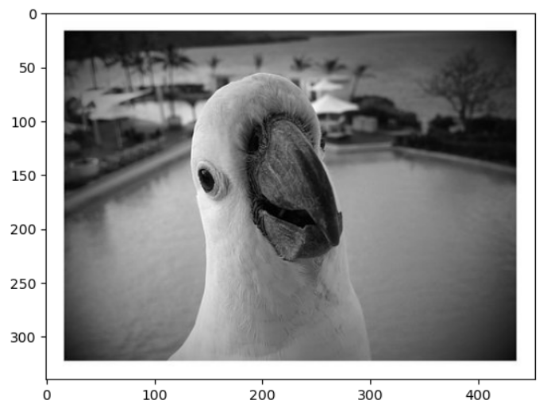
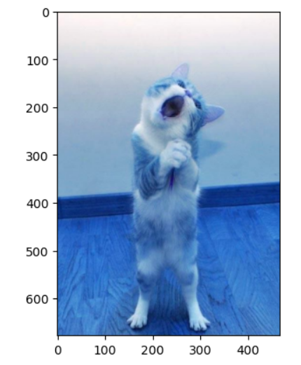
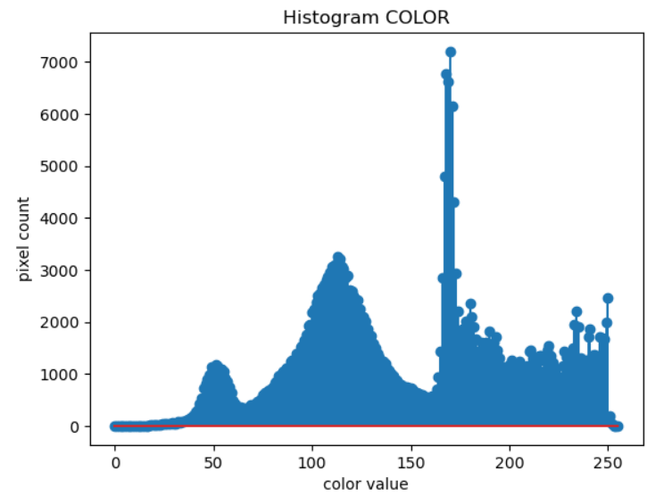
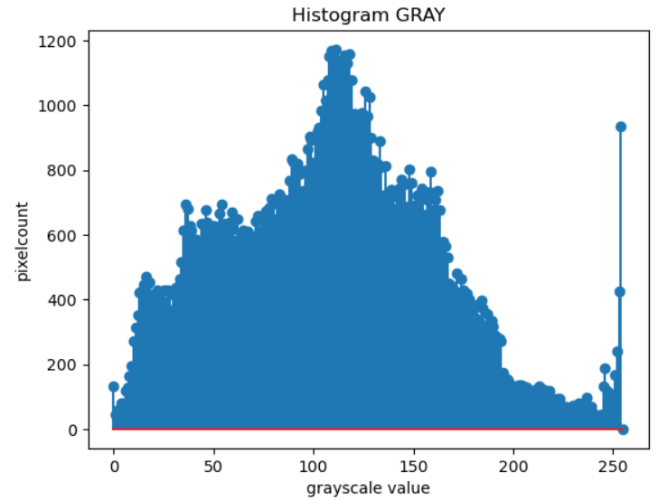
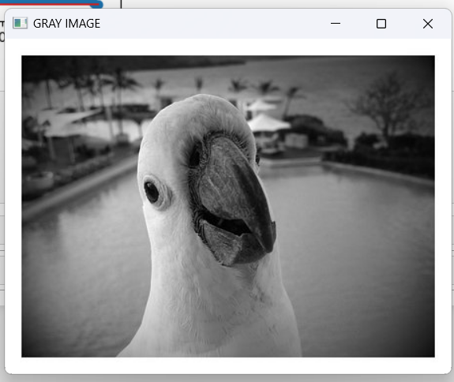
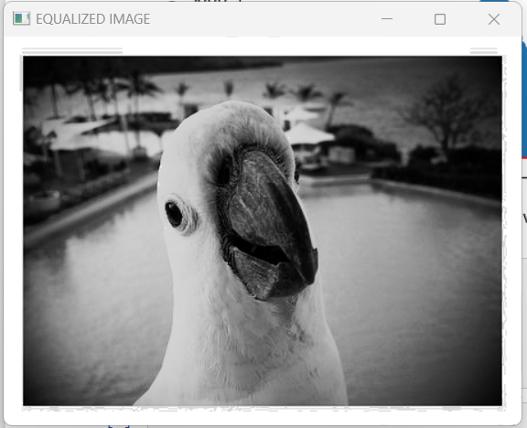

## Histogram and Histogram Equalization of an image ##
## AIM: ##

To obtain a histogram for finding the frequency of pixels in an Image with pixel values ranging from 0 to 255. Also write the code using OpenCV to perform histogram equalization.

## SOFTWARE REQUIRED: ##
Anaconda - Python 3.7

## ALGORITHM: ##
## Step 1: ##

Import the necessary libraries and read two images, Color image and Gray Scale image.

## Step 2: ##

Calculate the Histogram of Gray scale image and any one channel of the color image.

## Step 3: ##

Display the histograms.

## Step 4: ##

Equalize the grayscale image.

## Step 5: ##

Display the equalized grayscale image.

## Program: ##
```py
Developed By :Virgil Jovita A
Register Number : 212221240062

import cv2
import matplotlib.pyplot as plt

gray = cv2.imread('gray.jpg')
color= cv2.imread('cat.jpg')
plt.imshow(gray)
plt.show()
plt.imshow(color)
plt.show()
Display the histogram of gray scale image and any one channel histogram from color image.
gray_hist = cv2.calcHist([gray],[0],None,[256],[0,255])
plt.figure()
plt.title("Histogram GRAY")
plt.xlabel("grayscale value")
plt.ylabel("pixelcount")
plt.stem(gray_hist)
plt.show()

color_hist = cv2.calcHist([color],[1],None,[256],[0,256])
plt.figure()
plt.title("Histogram COLOR")
plt.xlabel('color value')
plt.ylabel('pixel count')
plt.stem(color_hist)
plt.show()
import cv2
gray=cv2.imread('gray.jpg',0)
equ = cv2.equalizeHist(gray)
cv2.imshow('GRAY IMAGE',gray)
cv2.imshow('EQUALIZED IMAGE',equ)
cv2.waitKey(0)
cv2.destroyAllWindows()
```
## Output: ##
## Input Grayscale Image and Color Image ##


## Histogram of Grayscale Image and any channel of Color Image


## Histogram Equalization of Grayscale Image


## Result: ##
Thus the histogram for finding the frequency of pixels in an image with pixel values ranging from 0 to 255 is obtained. Also,histogram equalization is done for the gray scale image using OpenCV.

